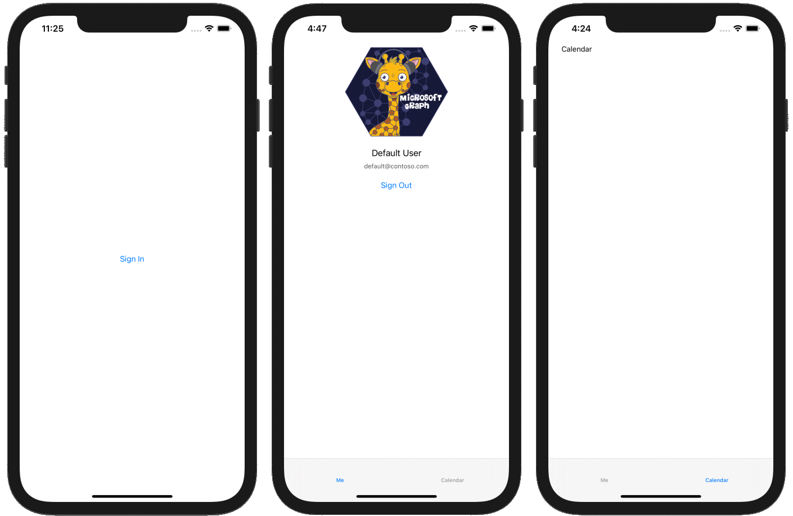

<!-- markdownlint-disable MD002 MD041 -->

<span data-ttu-id="74ceb-101">Erstellen Sie zunächst ein neues SWIFT-Projekt.</span><span class="sxs-lookup"><span data-stu-id="74ceb-101">Begin by creating a new Swift project.</span></span>

1. <span data-ttu-id="74ceb-102">Öffnen Sie Xcode.</span><span class="sxs-lookup"><span data-stu-id="74ceb-102">Open Xcode.</span></span> <span data-ttu-id="74ceb-103">Wählen Sie im Menü **Datei** die Option **neu**und dann **Projekt**aus.</span><span class="sxs-lookup"><span data-stu-id="74ceb-103">On the **File** menu, select **New**, then **Project**.</span></span>
1. <span data-ttu-id="74ceb-104">Wählen Sie die Vorlage **einzelne Ansicht-App** aus, und wählen Sie **weiter**aus.</span><span class="sxs-lookup"><span data-stu-id="74ceb-104">Choose the **Single View App** template and select **Next**.</span></span>

    

1. <span data-ttu-id="74ceb-106">Legen Sie den **Produktnamen** auf `GraphTutorial` und die **Sprache** auf **Objective-C**fest.</span><span class="sxs-lookup"><span data-stu-id="74ceb-106">Set the **Product Name** to `GraphTutorial` and the **Language** to **Objective-C**.</span></span>
1. <span data-ttu-id="74ceb-107">Füllen Sie die restlichen Felder aus, und wählen Sie **weiter**aus.</span><span class="sxs-lookup"><span data-stu-id="74ceb-107">Fill in the remaining fields and select **Next**.</span></span>
1. <span data-ttu-id="74ceb-108">Wählen Sie einen Speicherort für das Projekt aus, und wählen Sie **Erstellen**aus.</span><span class="sxs-lookup"><span data-stu-id="74ceb-108">Choose a location for the project and select **Create**.</span></span>

## <a name="install-dependencies"></a><span data-ttu-id="74ceb-109">Installieren von Abhängigkeiten</span><span class="sxs-lookup"><span data-stu-id="74ceb-109">Install dependencies</span></span>

<span data-ttu-id="74ceb-110">Installieren Sie vor dem Verschieben einige zusätzliche Abhängigkeiten, die Sie später verwenden werden.</span><span class="sxs-lookup"><span data-stu-id="74ceb-110">Before moving on, install some additional dependencies that you will use later.</span></span>

- <span data-ttu-id="74ceb-111">[Microsoft Authentication Library (MSAL) für IOS](https://github.com/AzureAD/microsoft-authentication-library-for-objc) zur Authentifizierung mit Azure AD.</span><span class="sxs-lookup"><span data-stu-id="74ceb-111">[Microsoft Authentication Library (MSAL) for iOS](https://github.com/AzureAD/microsoft-authentication-library-for-objc) for authenticating to with Azure AD.</span></span>
- <span data-ttu-id="74ceb-112">[MSAL-Authentifizierungsanbieter für Objective C](https://github.com/microsoftgraph/msgraph-sdk-objc-auth) zum Verbinden von MSAL mit dem Microsoft Graph-SDK.</span><span class="sxs-lookup"><span data-stu-id="74ceb-112">[MSAL Authentication Provider for Objective C](https://github.com/microsoftgraph/msgraph-sdk-objc-auth) to connect MSAL with the Microsoft Graph SDK.</span></span>
- <span data-ttu-id="74ceb-113">[Microsoft Graph-SDK für Objective C](https://github.com/microsoftgraph/msgraph-sdk-objc) zum tätigen von Anrufen an Microsoft Graph.</span><span class="sxs-lookup"><span data-stu-id="74ceb-113">[Microsoft Graph SDK for Objective C](https://github.com/microsoftgraph/msgraph-sdk-objc) for making calls to Microsoft Graph.</span></span>
- <span data-ttu-id="74ceb-114">[Microsoft Graph-Modell SDK für Objective C](https://github.com/microsoftgraph/msgraph-sdk-objc-models) für stark typisierte Objekte, die Microsoft Graph-Ressourcen wie Benutzer oder Ereignisse darstellen.</span><span class="sxs-lookup"><span data-stu-id="74ceb-114">[Microsoft Graph Models SDK for Objective C](https://github.com/microsoftgraph/msgraph-sdk-objc-models) for strongly-typed objects representing Microsoft Graph resources like users or events.</span></span>

1. <span data-ttu-id="74ceb-115">Beenden Sie Xcode.</span><span class="sxs-lookup"><span data-stu-id="74ceb-115">Quit Xcode.</span></span>
1. <span data-ttu-id="74ceb-116">Öffnen Sie Terminal, und ändern Sie das Verzeichnis in den Speicherort Ihres **GraphTutorial** -Projekts.</span><span class="sxs-lookup"><span data-stu-id="74ceb-116">Open Terminal and change the directory to the location of your **GraphTutorial** project.</span></span>
1. <span data-ttu-id="74ceb-117">Führen Sie den folgenden Befehl aus, um eine Podfile zu erstellen.</span><span class="sxs-lookup"><span data-stu-id="74ceb-117">Run the following command to create a Podfile.</span></span>

    ```Shell
    pod init
    ```

1. <span data-ttu-id="74ceb-118">Öffnen Sie die Podfile, und fügen Sie die folgenden Zeilen `use_frameworks!` unmittelbar nach der Zeile hinzu.</span><span class="sxs-lookup"><span data-stu-id="74ceb-118">Open the Podfile and add the following lines just after the `use_frameworks!` line.</span></span>

    ```Ruby
    pod 'MSAL', '~> 0.3.0'
    pod 'MSGraphMSALAuthProvider', '~> 0.1.1'
    pod 'MSGraphClientSDK', ' ~> 0.1.3'
    pod 'MSGraphClientModels', '~> 0.1.1'
    ```

1. <span data-ttu-id="74ceb-119">Speichern Sie die Podfile, und führen Sie dann den folgenden Befehl aus, um die Abhängigkeiten zu installieren.</span><span class="sxs-lookup"><span data-stu-id="74ceb-119">Save the Podfile, then run the following command to install the dependencies.</span></span>

    ```Shell
    pod install
    ```

1. <span data-ttu-id="74ceb-120">Nachdem der Befehl abgeschlossen ist, öffnen Sie das neu erstellte **GraphTutorial. xcworkspace.** in Xcode.</span><span class="sxs-lookup"><span data-stu-id="74ceb-120">Once the command completes, open the newly created **GraphTutorial.xcworkspace** in Xcode.</span></span>

## <a name="design-the-app"></a><span data-ttu-id="74ceb-121">Entwerfen der APP</span><span class="sxs-lookup"><span data-stu-id="74ceb-121">Design the app</span></span>

<span data-ttu-id="74ceb-122">In diesem Abschnitt werden die Ansichten für die App erstellt: eine Anmeldeseite, ein Registerkartenleisten-Navigator, eine Willkommensseite und eine Kalender Seite.</span><span class="sxs-lookup"><span data-stu-id="74ceb-122">In this section you will create the views for the app: a sign in page, a tab bar navigator, a welcome page, and a calendar page.</span></span> <span data-ttu-id="74ceb-123">Außerdem erstellen Sie ein Aktivitäts Indikator-Overlay.</span><span class="sxs-lookup"><span data-stu-id="74ceb-123">You'll also create an activity indicator overlay.</span></span>

### <a name="create-sign-in-page"></a><span data-ttu-id="74ceb-124">Anmeldeseite erstellen</span><span class="sxs-lookup"><span data-stu-id="74ceb-124">Create sign in page</span></span>

1. <span data-ttu-id="74ceb-125">Erweitern Sie den Ordner **GraphTutorial** in Xcode, und wählen Sie dann die Datei **ViewController. m** aus.</span><span class="sxs-lookup"><span data-stu-id="74ceb-125">Expand the **GraphTutorial** folder in Xcode, then select the **ViewController.m** file.</span></span>
1. <span data-ttu-id="74ceb-126">Ändern Sie `SignInViewController.m`im **Datei Inspektor**den **Namen** der Datei in.</span><span class="sxs-lookup"><span data-stu-id="74ceb-126">In the **File Inspector**, change the **Name** of the file to `SignInViewController.m`.</span></span>

    

1. <span data-ttu-id="74ceb-128">Öffnen Sie **SignInViewController. m** , und ersetzen Sie den Inhalt durch den folgenden Code.</span><span class="sxs-lookup"><span data-stu-id="74ceb-128">Open **SignInViewController.m** and replace its contents with the following code.</span></span>

    ```objc
    #import "SignInViewController.h"

    @interface SignInViewController ()

    @end

    @implementation SignInViewController

    - (void)viewDidLoad {
        [super viewDidLoad];
        // Do any additional setup after loading the view.
    }

    - (IBAction)signIn {
        [self performSegueWithIdentifier: @"userSignedIn" sender: nil];
    }
    @end
    ```

1. <span data-ttu-id="74ceb-129">Wählen Sie die Datei **ViewController. h** aus.</span><span class="sxs-lookup"><span data-stu-id="74ceb-129">Select the **ViewController.h** file.</span></span>
1. <span data-ttu-id="74ceb-130">Ändern Sie `SignInViewController.h`im **Datei Inspektor**den **Namen** der Datei in.</span><span class="sxs-lookup"><span data-stu-id="74ceb-130">In the **File Inspector**, change the **Name** of the file to `SignInViewController.h`.</span></span>
1. <span data-ttu-id="74ceb-131">Öffnen Sie **SignInViewController. h** , und ändern Sie `ViewController` alle `SignInViewController`Instanzen von in.</span><span class="sxs-lookup"><span data-stu-id="74ceb-131">Open **SignInViewController.h** and change all instances of `ViewController` to `SignInViewController`.</span></span>

1. <span data-ttu-id="74ceb-132">Öffnen Sie die Datei **Main. Storyboard** .</span><span class="sxs-lookup"><span data-stu-id="74ceb-132">Open the **Main.storyboard** file.</span></span>
1. <span data-ttu-id="74ceb-133">Erweitern Sie **View Controller Scene**, und wählen Sie dann **View Controller**aus.</span><span class="sxs-lookup"><span data-stu-id="74ceb-133">Expand **View Controller Scene**, then select **View Controller**.</span></span>

    

1. <span data-ttu-id="74ceb-135">Wählen Sie den **Identitäts Inspektor**aus, und ändern Sie dann das Dropdownmenü **Klasse** in **SignInViewController**.</span><span class="sxs-lookup"><span data-stu-id="74ceb-135">Select the **Identity Inspector**, then change the **Class** dropdown to **SignInViewController**.</span></span>

    

1. <span data-ttu-id="74ceb-137">Wählen Sie die **Bibliothek**aus, und ziehen Sie dann eine **Schaltfläche** auf den **Anmelde Ansichts Controller**.</span><span class="sxs-lookup"><span data-stu-id="74ceb-137">Select the **Library**, then drag a **Button** onto the **Sign In View Controller**.</span></span>

    

1. <span data-ttu-id="74ceb-139">Wählen Sie mit ausgewählter Schaltfläche den **Attributes Inspector** aus, und ändern Sie den `Sign In` **Titel** der Schaltfläche in.</span><span class="sxs-lookup"><span data-stu-id="74ceb-139">With the button selected, select the **Attributes Inspector** and change the **Title** of the button to `Sign In`.</span></span>

    

1. <span data-ttu-id="74ceb-141">Wählen Sie den **Controller anmelden**aus, und wählen Sie dann den **Verbindungs Inspektor**aus.</span><span class="sxs-lookup"><span data-stu-id="74ceb-141">Select the **Sign In View Controller**, then select the **Connections Inspector**.</span></span>
1. <span data-ttu-id="74ceb-142">Ziehen Sie unter **empfangene Aktionen**den ungefüllten Kreis neben **SignIn** auf die Schaltfläche.</span><span class="sxs-lookup"><span data-stu-id="74ceb-142">Under **Received Actions**, drag the unfilled circle next to **signIn** onto the button.</span></span> <span data-ttu-id="74ceb-143">Wählen Sie im Popup Menü die Option nach **oben innen berühren** aus.</span><span class="sxs-lookup"><span data-stu-id="74ceb-143">Select **Touch Up Inside** on the pop-up menu.</span></span>

    

1. <span data-ttu-id="74ceb-145">Wählen Sie im Menü **Editor** die Option **Probleme beim automatischen Layout auflösen**aus, und wählen Sie dann **unter alle Ansichten im Steuersatz-Ansichts Controller** **fehlende Abhängigkeiten hinzufügen** aus.</span><span class="sxs-lookup"><span data-stu-id="74ceb-145">On the **Editor** menu, select **Resolve Auto Layout Issues**, then select **Add Missing Constraints** underneath **All Views in Sign In View Controller**.</span></span>

### <a name="create-tab-bar"></a><span data-ttu-id="74ceb-146">Registerkartenleiste erstellen</span><span class="sxs-lookup"><span data-stu-id="74ceb-146">Create tab bar</span></span>

1. <span data-ttu-id="74ceb-147">Wählen Sie die **Bibliothek**aus, und ziehen Sie dann einen **Registerkartenleisten-Controller** auf das Storyboard.</span><span class="sxs-lookup"><span data-stu-id="74ceb-147">Select the **Library**, then drag a **Tab Bar Controller** onto the storyboard.</span></span>
1. <span data-ttu-id="74ceb-148">Wählen Sie den **Controller anmelden**aus, und wählen Sie dann den **Verbindungs Inspektor**aus.</span><span class="sxs-lookup"><span data-stu-id="74ceb-148">Select the **Sign In View Controller**, then select the **Connections Inspector**.</span></span>
1. <span data-ttu-id="74ceb-149">Ziehen Sie unter **ausgelöste Segues**den ungefüllten Kreis neben **manuell** auf den **Registerkartenleisten-Controller** auf dem Storyboard.</span><span class="sxs-lookup"><span data-stu-id="74ceb-149">Under **Triggered Segues**, drag the unfilled circle next to **manual** onto the **Tab Bar Controller** on the storyboard.</span></span> <span data-ttu-id="74ceb-150">Wählen Sie im Popup Menü **Modal** aus.</span><span class="sxs-lookup"><span data-stu-id="74ceb-150">Select **Present Modally** in the pop-up menu.</span></span>

    

1. <span data-ttu-id="74ceb-152">Wählen Sie das soeben hinzugefügte segue aus, und wählen Sie dann den **Attributes Inspector**aus.</span><span class="sxs-lookup"><span data-stu-id="74ceb-152">Select the segue you just added, then select the **Attributes Inspector**.</span></span> <span data-ttu-id="74ceb-153">Legen Sie \*\*\*\* das Feldbezeichner `userSignedIn`auf fest.</span><span class="sxs-lookup"><span data-stu-id="74ceb-153">Set the **Identifier** field to `userSignedIn`.</span></span>

    

1. <span data-ttu-id="74ceb-155">Wählen Sie die **Szene Element 1**aus, und wählen Sie dann den **Verbindungs Inspektor**aus.</span><span class="sxs-lookup"><span data-stu-id="74ceb-155">Select the **Item 1 Scene**, then select the **Connections Inspector**.</span></span>
1. <span data-ttu-id="74ceb-156">Ziehen Sie unter **ausgelöste Segues**den ungefüllten Kreis neben **manuell** auf den **Anmelde Ansichts Controller** auf dem Storyboard.</span><span class="sxs-lookup"><span data-stu-id="74ceb-156">Under **Triggered Segues**, drag the unfilled circle next to **manual** onto the **Sign In View Controller** on the storyboard.</span></span> <span data-ttu-id="74ceb-157">Wählen Sie im Popup Menü **Modal** aus.</span><span class="sxs-lookup"><span data-stu-id="74ceb-157">Select **Present Modally** in the pop-up menu.</span></span>
1. <span data-ttu-id="74ceb-158">Wählen Sie das soeben hinzugefügte segue aus, und wählen Sie dann den **Attributes Inspector**aus.</span><span class="sxs-lookup"><span data-stu-id="74ceb-158">Select the segue you just added, then select the **Attributes Inspector**.</span></span> <span data-ttu-id="74ceb-159">Legen Sie \*\*\*\* das Feldbezeichner `userSignedOut`auf fest.</span><span class="sxs-lookup"><span data-stu-id="74ceb-159">Set the **Identifier** field to `userSignedOut`.</span></span>

### <a name="create-welcome-page"></a><span data-ttu-id="74ceb-160">Willkommensseite erstellen</span><span class="sxs-lookup"><span data-stu-id="74ceb-160">Create welcome page</span></span>

1. <span data-ttu-id="74ceb-161">Wählen Sie die Datei **Assets. xcassets** aus.</span><span class="sxs-lookup"><span data-stu-id="74ceb-161">Select the **Assets.xcassets** file.</span></span>
1. <span data-ttu-id="74ceb-162">Wählen Sie im Menü **Editor** die Option **Objekte hinzufügen**und dann **neuer Bildsatz**aus.</span><span class="sxs-lookup"><span data-stu-id="74ceb-162">On the **Editor** menu, select **Add Assets**, then **New Image Set**.</span></span>
1. <span data-ttu-id="74ceb-163">Wählen Sie das neue **Image** -Objekt aus, und verwenden Sie den **Attribut Inspektor** , um seinen **Namen** auf `DefaultUserPhoto`festzulegen.</span><span class="sxs-lookup"><span data-stu-id="74ceb-163">Select the new **Image** asset and use the **Attribute Inspector** to set its **Name** to `DefaultUserPhoto`.</span></span>
1. <span data-ttu-id="74ceb-164">Fügen Sie ein beliebiges Bild hinzu, das Sie als Standardbenutzer Profilfoto dienen möchten.</span><span class="sxs-lookup"><span data-stu-id="74ceb-164">Add any image you like to serve as a default user profile photo.</span></span>

    

1. <span data-ttu-id="74ceb-166">Erstellen Sie eine neue **Cocoa Touch-Klassen** Datei im **GraphTutorial** - `WelcomeViewController`Ordner mit dem Namen.</span><span class="sxs-lookup"><span data-stu-id="74ceb-166">Create a new **Cocoa Touch Class** file in the **GraphTutorial** folder named `WelcomeViewController`.</span></span> <span data-ttu-id="74ceb-167">Wählen Sie **ulviewcontroller** in der unter **Klasse von Field aus** .</span><span class="sxs-lookup"><span data-stu-id="74ceb-167">Choose **UIViewController** in the **Subclass of** field.</span></span>
1. <span data-ttu-id="74ceb-168">Öffnen Sie **WelcomeViewController. h** , und fügen Sie den folgenden `@interface` Code innerhalb der Deklaration hinzu.</span><span class="sxs-lookup"><span data-stu-id="74ceb-168">Open **WelcomeViewController.h** and add the following code inside the `@interface` declaration.</span></span>

    ```objc
    @property (nonatomic) IBOutlet UIImageView *userProfilePhoto;
    @property (nonatomic) IBOutlet UILabel *userDisplayName;
    @property (nonatomic) IBOutlet UILabel *userEmail;
    ```

1. <span data-ttu-id="74ceb-169">Öffnen Sie **WelcomeViewController. m** , und ersetzen Sie den Inhalt durch den folgenden Code.</span><span class="sxs-lookup"><span data-stu-id="74ceb-169">Open **WelcomeViewController.m** and replace its contents with the following code.</span></span>

    ```objc
    #import "WelcomeViewController.h"

    @interface WelcomeViewController ()

    @end

    @implementation WelcomeViewController

    - (void)viewDidLoad {
        [super viewDidLoad];
        // Do any additional setup after loading the view.

        // TEMPORARY
        self.userProfilePhoto.image = [UIImage imageNamed:@"DefaultUserPhoto"];
        self.userDisplayName.text = @"Default User";
        [self.userDisplayName sizeToFit];
        self.userEmail.text = @"default@contoso.com";
        [self.userEmail sizeToFit];
    }

    - (IBAction)signOut {
        [self performSegueWithIdentifier: @"userSignedOut" sender: nil];
    }

    @end
    ```

1. <span data-ttu-id="74ceb-170">Öffnen Sie **Main. Storyboard**.</span><span class="sxs-lookup"><span data-stu-id="74ceb-170">Open **Main.storyboard**.</span></span> <span data-ttu-id="74ceb-171">Wählen Sie die **Szene Element 1**aus, und wählen Sie dann den **Identitäts Inspektor**aus.</span><span class="sxs-lookup"><span data-stu-id="74ceb-171">Select the **Item 1 Scene**, then select the **Identity Inspector**.</span></span> <span data-ttu-id="74ceb-172">Ändern Sie den Wert der **Klasse** in **WelcomeViewController**.</span><span class="sxs-lookup"><span data-stu-id="74ceb-172">Change the **Class** value to **WelcomeViewController**.</span></span>
1. <span data-ttu-id="74ceb-173">Fügen Sie mithilfe der **Bibliothek**die folgenden Elemente zur **Szene Element 1**hinzu.</span><span class="sxs-lookup"><span data-stu-id="74ceb-173">Using the **Library**, add the following items to the **Item 1 Scene**.</span></span>

    - <span data-ttu-id="74ceb-174">Eine **Bildansicht**</span><span class="sxs-lookup"><span data-stu-id="74ceb-174">One **Image View**</span></span>
    - <span data-ttu-id="74ceb-175">Zwei **Beschriftungen**</span><span class="sxs-lookup"><span data-stu-id="74ceb-175">Two **Labels**</span></span>
    - <span data-ttu-id="74ceb-176">Eine **Schaltfläche**</span><span class="sxs-lookup"><span data-stu-id="74ceb-176">One **Button**</span></span>

1. <span data-ttu-id="74ceb-177">Wählen Sie die Ansicht Bild aus, und wählen Sie dann den **Größen Inspektor**aus.</span><span class="sxs-lookup"><span data-stu-id="74ceb-177">Select the image view, then select the **Size Inspector**.</span></span>
1. <span data-ttu-id="74ceb-178">Legen Sie die **Breite** und **Höhe** auf 196 fest.</span><span class="sxs-lookup"><span data-stu-id="74ceb-178">Set the **Width** and **Height** to 196.</span></span>
1. <span data-ttu-id="74ceb-179">Wählen Sie die zweite Bezeichnung aus, und wählen Sie dann den **Attribut Inspektor**aus.</span><span class="sxs-lookup"><span data-stu-id="74ceb-179">Select the second label, then select the **Attributes Inspector**.</span></span>
1. <span data-ttu-id="74ceb-180">Ändern Sie die **Farbe** in **dunkelgrau**und ändern Sie die **Schriftart** in **System 12,0**.</span><span class="sxs-lookup"><span data-stu-id="74ceb-180">Change the **Color** to **Dark Gray Color**, and change the **Font** to **System 12.0**.</span></span>
1. <span data-ttu-id="74ceb-181">Wählen Sie die Schaltfläche aus, und wählen Sie dann den **Attribut Inspektor**aus.</span><span class="sxs-lookup"><span data-stu-id="74ceb-181">Select the button, then select the **Attributes Inspector**.</span></span>
1. <span data-ttu-id="74ceb-182">Ändern Sie \*\*\*\* den Titel `Sign Out`in.</span><span class="sxs-lookup"><span data-stu-id="74ceb-182">Change the **Title** to `Sign Out`.</span></span>
1. <span data-ttu-id="74ceb-183">Stellen Sie über den **Connections Inspector**folgende Verbindungen her.</span><span class="sxs-lookup"><span data-stu-id="74ceb-183">Using the **Connections Inspector**, make the following connections.</span></span>

    - <span data-ttu-id="74ceb-184">Verknüpfen Sie die **User** -Steckdose mit dem ersten Etikett.</span><span class="sxs-lookup"><span data-stu-id="74ceb-184">Link the **userDisplayName** outlet to the first label.</span></span>
    - <span data-ttu-id="74ceb-185">Verknüpfen Sie die **userEmail** -Steckdose mit der zweiten Bezeichnung.</span><span class="sxs-lookup"><span data-stu-id="74ceb-185">Link the **userEmail** outlet to the second label.</span></span>
    - <span data-ttu-id="74ceb-186">Verknüpfen Sie die **userProfilePhoto** -Steckdose mit der Bildansicht.</span><span class="sxs-lookup"><span data-stu-id="74ceb-186">Link the **userProfilePhoto** outlet to the image view.</span></span>
    - <span data-ttu-id="74ceb-187">Verknüpfen Sie die Aktion " **abgemeldete** empfangen" mit dem Touch der Schaltfläche nach **innen**.</span><span class="sxs-lookup"><span data-stu-id="74ceb-187">Link the **signOut** received action to the button's **Touch Up Inside**.</span></span>

1. <span data-ttu-id="74ceb-188">Wählen Sie das Element der Registerkartenleiste am unteren Rand der Szene aus, und wählen Sie dann den **Attributes Inspector**aus.</span><span class="sxs-lookup"><span data-stu-id="74ceb-188">Select the tab bar item at the bottom of the scene, then select the **Attributes Inspector**.</span></span> <span data-ttu-id="74ceb-189">Ändern Sie \*\*\*\* den Titel `Me`in.</span><span class="sxs-lookup"><span data-stu-id="74ceb-189">Change the **Title** to `Me`.</span></span>
1. <span data-ttu-id="74ceb-190">Wählen Sie im Menü **Editor** die Option **Probleme beim automatischen Layout auflösen**aus, und wählen Sie dann **fehlende Abhängigkeiten** unterhalb **aller Ansichten im Begrüßungs Ansichts Controller**hinzufügen aus.</span><span class="sxs-lookup"><span data-stu-id="74ceb-190">On the **Editor** menu, select **Resolve Auto Layout Issues**, then select **Add Missing Constraints** underneath **All Views in Welcome View Controller**.</span></span>

<span data-ttu-id="74ceb-191">Die Begrüßungs Szene sollte wie folgt aussehen, wenn Sie fertig sind.</span><span class="sxs-lookup"><span data-stu-id="74ceb-191">The welcome scene should look similar to this once you're done.</span></span>


### <a name="create-calendar-page"></a><span data-ttu-id="74ceb-193">Seite "Kalender erstellen"</span><span class="sxs-lookup"><span data-stu-id="74ceb-193">Create calendar page</span></span>

1. <span data-ttu-id="74ceb-194">Erstellen Sie eine neue **Cocoa Touch-Klassen** Datei im **GraphTutorial** - `CalendarViewController`Ordner mit dem Namen.</span><span class="sxs-lookup"><span data-stu-id="74ceb-194">Create a new **Cocoa Touch Class** file in the **GraphTutorial** folder named `CalendarViewController`.</span></span> <span data-ttu-id="74ceb-195">Wählen Sie **ulviewcontroller** in der unter **Klasse von Field aus** .</span><span class="sxs-lookup"><span data-stu-id="74ceb-195">Choose **UIViewController** in the **Subclass of** field.</span></span>
1. <span data-ttu-id="74ceb-196">Öffnen Sie **CalendarViewController. h** , und fügen Sie den folgenden `@interface` Code innerhalb der Deklaration hinzu.</span><span class="sxs-lookup"><span data-stu-id="74ceb-196">Open **CalendarViewController.h** and add the following code inside the `@interface` declaration.</span></span>

    ```objc
    @property (nonatomic) IBOutlet UITextView *calendarJSON;
    ```

1. <span data-ttu-id="74ceb-197">Öffnen Sie **CalendarViewController. m** , und ersetzen Sie den Inhalt durch den folgenden Code.</span><span class="sxs-lookup"><span data-stu-id="74ceb-197">Open **CalendarViewController.m** and replace its contents with the following code.</span></span>

    ```objc
    #import "CalendarViewController.h"

    @interface CalendarViewController ()

    @end

    @implementation CalendarViewController

    - (void)viewDidLoad {
        [super viewDidLoad];
        // Do any additional setup after loading the view.

        // TEMPORARY
        self.calendarJSON.text = @"Calendar";
        [self.calendarJSON sizeToFit];
    }

    @end
    ```

1. <span data-ttu-id="74ceb-198">Öffnen Sie **Main. Storyboard**.</span><span class="sxs-lookup"><span data-stu-id="74ceb-198">Open **Main.storyboard**.</span></span> <span data-ttu-id="74ceb-199">Wählen Sie die **Szene Element 2**aus, und wählen Sie dann den **Identitäts Inspektor**aus.</span><span class="sxs-lookup"><span data-stu-id="74ceb-199">Select the **Item 2 Scene**, then select the **Identity Inspector**.</span></span> <span data-ttu-id="74ceb-200">Ändern Sie den Wert der **Klasse** in **CalendarViewController**.</span><span class="sxs-lookup"><span data-stu-id="74ceb-200">Change the **Class** value to **CalendarViewController**.</span></span>
1. <span data-ttu-id="74ceb-201">Fügen Sie mithilfe der **Bibliothek**eine **Text Ansicht** zur **Szene "Element 2**" hinzu.</span><span class="sxs-lookup"><span data-stu-id="74ceb-201">Using the **Library**, add a **Text View** to the **Item 2 Scene**.</span></span>
1. <span data-ttu-id="74ceb-202">Wählen Sie die soeben hinzugefügte Textansicht aus.</span><span class="sxs-lookup"><span data-stu-id="74ceb-202">Select the text view you just added.</span></span> <span data-ttu-id="74ceb-203">Wählen Sie im **Editor** **Einbetten in**und dann **Bildlaufansicht**aus.</span><span class="sxs-lookup"><span data-stu-id="74ceb-203">On the **Editor**, choose **Embed In**, then **Scroll View**.</span></span>
1. <span data-ttu-id="74ceb-204">Verbinden Sie die **calendarJSON** -Steckdose mithilfe des **Verbindungs Inspektors**mit der Textansicht.</span><span class="sxs-lookup"><span data-stu-id="74ceb-204">Using the **Connections Inspector**, connect the **calendarJSON** outlet to the text view.</span></span>
1. 1. <span data-ttu-id="74ceb-205">Wählen Sie das Element der Registerkartenleiste am unteren Rand der Szene aus, und wählen Sie dann den **Attributes Inspector**aus.</span><span class="sxs-lookup"><span data-stu-id="74ceb-205">Select the tab bar item at the bottom of the scene, then select the **Attributes Inspector**.</span></span> <span data-ttu-id="74ceb-206">Ändern Sie \*\*\*\* den Titel `Calendar`in.</span><span class="sxs-lookup"><span data-stu-id="74ceb-206">Change the **Title** to `Calendar`.</span></span>
1. <span data-ttu-id="74ceb-207">Wählen Sie im Menü **Editor** die Option **Probleme beim automatischen Layout auflösen**aus, und wählen Sie dann **fehlende Abhängigkeiten** unterhalb **aller Ansichten im Begrüßungs Ansichts Controller**hinzufügen aus.</span><span class="sxs-lookup"><span data-stu-id="74ceb-207">On the **Editor** menu, select **Resolve Auto Layout Issues**, then select **Add Missing Constraints** underneath **All Views in Welcome View Controller**.</span></span>

<span data-ttu-id="74ceb-208">Die Kalender Szene sollte wie folgt aussehen, wenn Sie fertig sind.</span><span class="sxs-lookup"><span data-stu-id="74ceb-208">The calendar scene should look similar to this once you're done.</span></span>


### <a name="create-activity-indicator"></a><span data-ttu-id="74ceb-210">Aktivitäts Indikator erstellen</span><span class="sxs-lookup"><span data-stu-id="74ceb-210">Create activity indicator</span></span>

1. <span data-ttu-id="74ceb-211">Erstellen Sie eine neue **Cocoa Touch-Klassen** Datei im **GraphTutorial** - `SpinnerViewController`Ordner mit dem Namen.</span><span class="sxs-lookup"><span data-stu-id="74ceb-211">Create a new **Cocoa Touch Class** file in the **GraphTutorial** folder named `SpinnerViewController`.</span></span> <span data-ttu-id="74ceb-212">Wählen Sie **ulviewcontroller** in der unter **Klasse von Field aus** .</span><span class="sxs-lookup"><span data-stu-id="74ceb-212">Choose **UIViewController** in the **Subclass of** field.</span></span>
1. <span data-ttu-id="74ceb-213">Öffnen Sie **SpinnerViewController. h** , und fügen Sie den folgenden `@interface` Code innerhalb der Deklaration hinzu.</span><span class="sxs-lookup"><span data-stu-id="74ceb-213">Open **SpinnerViewController.h** and add the following code inside the `@interface` declaration.</span></span>

    ```objc
    - (void) startWithContainer:(UIViewController*) container;
    - (void) stop;
    ```

1. <span data-ttu-id="74ceb-214">Öffnen Sie **SpinnerViewController. m** , und ersetzen Sie den Inhalt durch den folgenden Code.</span><span class="sxs-lookup"><span data-stu-id="74ceb-214">Open **SpinnerViewController.m** and replace its contents with the following code.</span></span>

    ```objc
    #import "SpinnerViewController.h"

    @interface SpinnerViewController ()
    @property (nonatomic) UIActivityIndicatorView* spinner;
    @end

    @implementation SpinnerViewController

    - (void)viewDidLoad {
        [super viewDidLoad];

        _spinner = [[UIActivityIndicatorView alloc] initWithActivityIndicatorStyle:
                    UIActivityIndicatorViewStyleWhiteLarge];

        self.view.backgroundColor = [UIColor colorWithWhite:0 alpha:0.7];
        [self.view addSubview:_spinner];

        _spinner.translatesAutoresizingMaskIntoConstraints = false;
        [_spinner startAnimating];

        [_spinner.centerXAnchor constraintEqualToAnchor:self.view.centerXAnchor].active = true;
        [_spinner.centerYAnchor constraintEqualToAnchor:self.view.centerYAnchor].active = true;
    }

    - (void) startWithContainer:(UIViewController *)container {
        [container addChildViewController:self];
        self.view.frame = container.view.frame;
        [container.view addSubview:self.view];
        [self didMoveToParentViewController:container];
    }

    - (void) stop {
        [self willMoveToParentViewController:nil];
        [self.view removeFromSuperview];
        [self removeFromParentViewController];
    }

    @end
    ```

## <a name="test-the-app"></a><span data-ttu-id="74ceb-215">Testen der App</span><span class="sxs-lookup"><span data-stu-id="74ceb-215">Test the app</span></span>

<span data-ttu-id="74ceb-216">Speichern Sie Ihre Änderungen, und starten Sie die app.</span><span class="sxs-lookup"><span data-stu-id="74ceb-216">Save your changes and launch the app.</span></span> <span data-ttu-id="74ceb-217">Sie sollten mit den Schaltflächen **Anmelden** und **Abmelden** und der Registerkartenleiste zwischen den Bildschirmen navigieren können.</span><span class="sxs-lookup"><span data-stu-id="74ceb-217">You should be able to move between the screens using the **Sign In** and **Sign Out** buttons and the tab bar.</span></span>


