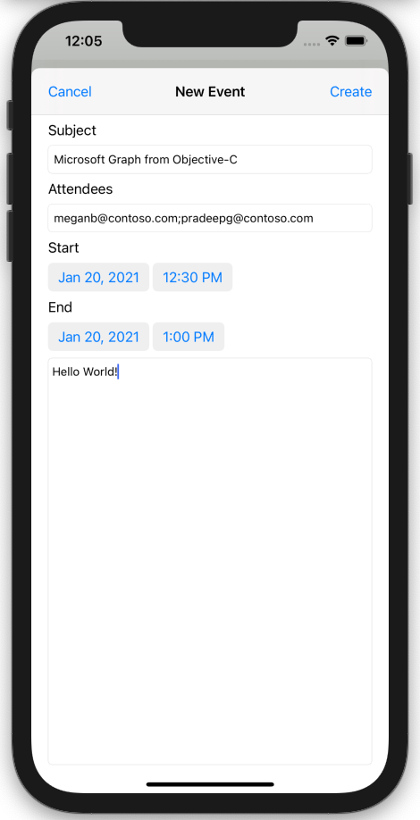

<!-- markdownlint-disable MD002 MD041 -->

In diesem Abschnitt fügen Sie die Möglichkeit zum Erstellen von Ereignissen im Kalender des Benutzers hinzu.

1. Öffnen **Sie GraphManager.h,** und fügen Sie den folgenden Code über der `@interface` Deklaration hinzu.

    ```objc
    typedef void (^CreateEventCompletionBlock)(MSGraphEvent* _Nullable event,
                                               NSError* _Nullable error);
    ```

1. Fügen Sie der Deklaration den folgenden Code `@interface` hinzu.

    ```objc
    - (void) createEventWithSubject: (NSString*) subject
                           andStart: (NSDate*) start
                             andEnd: (NSDate*) end
                       andAttendees: (NSArray<NSString*>* _Nullable) attendees
                            andBody: (NSString* _Nullable) body
                 andCompletionBlock: (CreateEventCompletionBlock) completion;
    ```

1. Öffnen **Sie GraphManager.m,** und fügen Sie die folgende Funktion hinzu, um ein neues Ereignis im Kalender des Benutzers zu erstellen.

    :::code language="objc" source="../demo/GraphTutorial/GraphTutorial/GraphManager.m" id="CreateEventSnippet":::

1. Erstellen Sie eine neue **Cocoa Touch Class-Datei** im **Ordner GraphTutorial** mit dem Namen `NewEventViewController` . Wählen **Sie "UIViewController"** in der **Unterklasse des Felds** aus.
1. Öffnen **Sie NewEventViewController.h,** und fügen Sie den folgenden Code in der Deklaration `@interface` hinzu.

    ```objectivec
    @property (nonatomic) IBOutlet UITextField* subject;
    @property (nonatomic) IBOutlet UITextField* attendees;
    @property (nonatomic) IBOutlet UIDatePicker* start;
    @property (nonatomic) IBOutlet UIDatePicker* end;
    @property (nonatomic) IBOutlet UITextView* body;
    ```

1. Öffnen **Sie NewEventController.m,** und ersetzen Sie den Inhalt durch den folgenden Code.

    :::code language="objc" source="../demo/GraphTutorial/GraphTutorial/NewEventViewController.m" id="NewEventViewControllerSnippet":::

1. Öffnen **Sie Main.storyboard**. Verwenden Sie die **Bibliothek,** um einen **Ansichtscontroller auf** das Storyboard zu ziehen.
1. Fügen Sie **mithilfe der Bibliothek** dem Ansichtscontroller eine **Navigationsleiste** hinzu.
1. Doppelklicken Sie auf **den Titel** in der Navigationsleiste, und aktualisieren Sie ihn in `New Event` .
1. Fügen Sie in  **der Bibliothek** links neben der Navigationsleiste ein Balkenschaltflächeelement hinzu.
1. Wählen Sie die Schaltfläche für die neue Leiste und dann den **Attributprüfungsinspektor aus.** Ändern **Sie den Titel** in `Cancel` .
1. Fügen Sie **in der Bibliothek** rechts neben der Navigationsleiste ein Balkenschaltflächeelement hinzu. 
1. Wählen Sie die Schaltfläche für die neue Leiste und dann den **Attributprüfungsinspektor aus.** Ändern **Sie den Titel** in `Create` .
1. Wählen Sie den Ansichtscontroller und dann den **Identitätsinspektor aus.** Ändern **Sie die Klasse** in **NewEventViewController**.
1. Fügen Sie der Ansicht die folgenden Steuerelemente **aus der Bibliothek** hinzu.

    - Fügen Sie **eine Bezeichnung unter** der Navigationsleiste hinzu. Legen Sie den Text auf `Subject` .
    - Fügen Sie **unter der Beschriftung** ein Textfeld hinzu. Legen Sie das **Platzhalterattribut auf** `Subject` .
    - Fügen Sie eine **Beschriftung** unter dem Textfeld hinzu. Legen Sie den Text auf `Attendees` .
    - Fügen Sie **unter der Beschriftung** ein Textfeld hinzu. Legen Sie das **Platzhalterattribut auf** `Separate multiple entries with ;` .
    - Fügen Sie eine **Beschriftung** unter dem Textfeld hinzu. Legen Sie den Text auf `Start` .
    - Fügen Sie **eine Datumsauswahl** unter der Bezeichnung hinzu. Legen Sie den **bevorzugten Stil auf** **"Komprimier",** das Intervall **auf 15** Minuten und die Höhe auf **35 fest.** 
    - Fügen Sie **eine Bezeichnung unter** der Datumsauswahl hinzu. Legen Sie den Text auf `End` .
    - Fügen Sie **eine Datumsauswahl unter** der Bezeichnung hinzu. Legen Sie den **bevorzugten Stil auf** **"Komprimier",** das Intervall **auf 15** Minuten und die Höhe auf **35 fest.** 
    - Fügen Sie **unter der Datumsauswahl** eine Textansicht hinzu.

1. Wählen Sie **den neuen Ereignisansichtscontroller aus,** und verwenden Sie den **Verbindungsinspektor,** um die folgenden Verbindungen herzustellen.

    - Verbinden Sie die **Aktion "Empfangener** Abbruch" mit der Schaltfläche **"Abbrechen".**
    - Verbinden Sie die **"createEvent** received"-Aktion mit der Schaltfläche **"Leiste** erstellen".
    - Verbinden Sie **den Betreff** mit dem ersten Textfeld.
    - Verbinden Sie **die Teilnehmer mit** dem zweiten Textfeld.
    - Verbinden Sie **den Startausgang** mit der ersten Datumsauswahl.
    - Schließen Sie **die Endauslaufe** mit der zweiten Datumsauswahl an.
    - Verbinden Sie **den Textkörper** mit der Textansicht.

1. Fügen Sie die folgenden Einschränkungen hinzu.

    - **Navigationsleiste**
        - Führendes Leerzeichen zum sicheren Bereich, Wert: 0
        - Nachgestellter Bereich zum sicheren Bereich, Wert: 0
        - Oberster Platz zum sicheren Bereich, Wert: 0
        - Höhe, Wert: 44
    - **Betreffbezeichnung**
        - Führendes Leerzeichen zum Rand "Ansicht", Wert: 0
        - Nachgestellter Abstand zum Rand anzeigen, Wert: 0
        - Oberster Bereich zur Navigationsleiste, Wert: 20
    - **Betrefftextfeld**
        - Führendes Leerzeichen zum Rand "Ansicht", Wert: 0
        - Nachgestellter Abstand zum Rand anzeigen, Wert: 0
        - Oberster Platz bis Betreffbezeichnung, Wert: Standard
    - **Bezeichnung "Teilnehmer"**
        - Führendes Leerzeichen zum Rand "Ansicht", Wert: 0
        - Nachgestellter Abstand zum Rand anzeigen, Wert: 0
        - Oberster Abstand zum Betrefftextfeld, Wert: Standard
    - **Teilnehmertextfeld**
        - Führendes Leerzeichen zum Rand "Ansicht", Wert: 0
        - Nachgestellter Abstand zum Rand anzeigen, Wert: 0
        - Oberster Platz für "Attendees"-Bezeichnung, Wert: Standard
    - **Bezeichnung starten**
        - Führendes Leerzeichen zum Rand "Ansicht", Wert: 0
        - Nachgestellter Abstand zum Rand anzeigen, Wert: 0
        - Oberster Abstand zum Betrefftextfeld, Wert: Standard
    - **Auswahl für Startdatum**
        - Führendes Leerzeichen zum Rand "Ansicht", Wert: 0
        - Nachgestellter Abstand zum Rand anzeigen, Wert: 0
        - Oberster Platz für "Attendees"-Bezeichnung, Wert: Standard
        - Höhe, Wert: 35
    - **Endbeschriftung**
        - Führendes Leerzeichen zum Rand "Ansicht", Wert: 0
        - Nachgestellter Abstand zum Rand anzeigen, Wert: 0
        - Oberster Platz bis Startdatumsauswahl, Wert: Standard
    - **Enddatumsauswahl**
        - Führendes Leerzeichen zum Rand "Ansicht", Wert: 0
        - Nachgestellter Abstand zum Rand anzeigen, Wert: 0
        - Oberster Abstand bis Ende der Bezeichnung, Wert: Standard
        - Höhe: 35
    - **Textkörperansicht**
        - Führendes Leerzeichen zum Rand "Ansicht", Wert: 0
        - Nachgestellter Abstand zum Rand anzeigen, Wert: 0
        - Oberster Bereich bis Enddatumsauswahl, Wert: Standard
        - Unterer Bereich bis Rand anzeigen, Wert: 0

    

1. Wählen Sie **die Kalenderszene** und dann den **Connections Inspector aus.**
1. Ziehen **Sie unter "Ausgelöste Segues"** den nicht ausgefüllten Kreis neben **manuell** auf den **Neuen Ereignisansichtscontroller** im Storyboard. Wählen **Sie im Popupmenü** "Modal präsentieren" aus.
1. Wählen Sie die gerade hinzugefügte Segue aus, und wählen Sie dann den **Attributes Inspector aus.** Legen Sie das **Bezeichnerfeld** auf `showEventForm` .
1. Verbinden Sie **die aktion "showNewEventForm** empfangen" mit der Schaltfläche der **+** Navigationsleiste.
1. Speichern Sie die Änderungen, und starten Sie die App neu. Wechseln Sie zur Kalenderseite, und tippen Sie auf die **+** Schaltfläche. Füllen Sie das Formular aus, und tippen **Sie auf "Erstellen",** um ein neues Ereignis zu erstellen.

    
